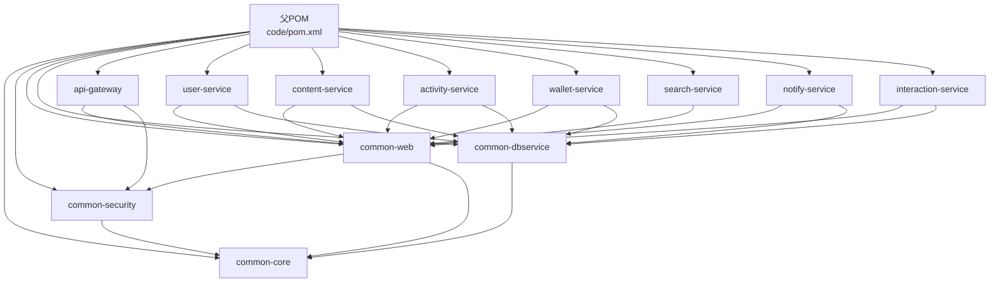

# 框架搭建实施计划

## 目标

在 [e:\github\sia\Problem_to_Hero_backend](e:\github\sia\Problem_to_Hero_backend) 目录下搭建完整的微服务开发框架。**所有代码相关工程与模块放到 `code/` 目录**，包括Maven多模块工程、公共模块、API网关等。

## 技术栈版本

基于 [doc/开发规范.md](doc/开发规范.md) 和 [doc/第一阶段框架搭建计划.md](doc/第一阶段框架搭建计划.md)：

- Java 21
- Spring Boot 3.2.5
- Spring Cloud 2023.0.1
- Spring Cloud Gateway 4.0.9
- MyBatis-Plus 3.5.5
- MySQL 8.0.35
- Redis 7.2.4
- RabbitMQ 3.12.10
- HikariCP 5.1.0

## 实施步骤

### 第一部分：Maven父工程创建

创建 `code/pom.xml` 父工程配置文件：

**核心配置内容**：

- `<groupId>com.sia</groupId>`
- `<artifactId>problem-to-hero-backend</artifactId>`
- `<packaging>pom</packaging>`
- Java 21 编译配置
- Spring Boot 3.2.5 和 Spring Cloud 2023.0.1 版本管理
- 统一依赖版本管理（`dependencyManagement`）
- 子模块声明（`<modules>`）

**子模块列表**：

```xml
<modules>
    <!-- 公共模块 -->
    <module>common/common-core</module>
    <module>common/common-security</module>
    <module>common/common-web</module>
    <module>common/common-dbservice</module>
    <!-- 网关模块 -->
    <module>gateway/api-gateway</module>
    <!-- 业务服务模块 -->
    <module>services/user-service</module>
    <module>services/content-service</module>
    <module>services/activity-service</module>
    <module>services/wallet-service</module>
    <module>services/search-service</module>
    <module>services/notify-service</module>
    <module>services/interaction-service</module>
</modules>
```

**注意**：父POM位于 `code/pom.xml`，子模块路径相对于code目录。

**关键依赖版本**：

- spring-boot: 3.2.5
- spring-cloud: 2023.0.1
- mybatis-plus: 3.5.5
- hutool: 5.8.25
- lombok: 1.18.30
- mapstruct: 1.5.5.Final
- jjwt: 0.12.5

### 第二部分：公共模块创建

基于 [doc/模块与目录结构定义.md](doc/模块与目录结构定义.md) 创建4个公共模块：

#### 1. common-core 模块

**目录路径**：`code/common/common-core/`

**包结构**：`com.sia.common.core`

**核心类**：

- `constant/` - 常量类
  - `CommonConstants.java` - 通用常量
  - `DateConstants.java` - 日期常量
  - `RegexConstants.java` - 正则表达式常量
- `enum/` - 枚举类
  - `ResultCodeEnum.java` - 响应码枚举（SUCCESS=200, ERROR=500等）
  - `YesNoEnum.java` - 是否枚举
  - `StatusEnum.java` - 状态枚举
- `exception/` - 异常类
  - `BaseException.java` - 基础异常
  - `BusinessException.java` - 业务异常
  - `SystemException.java` - 系统异常
- `util/` - 工具类
  - `DateUtil.java` - 日期工具
  - `StringUtil.java` - 字符串工具
  - `JsonUtil.java` - JSON工具
- `id/` - ID生成器
  - `IdGenerator.java` - ID生成器接口
  - `SnowflakeIdGenerator.java` - 雪花算法实现

**pom.xml依赖**：

- Hutool
- Lombok
- Jackson（JSON处理）

#### 2. common-security 模块

**目录路径**：`code/common/common-security/`

**包结构**：`com.sia.common.security`

**核心类**：

- `jwt/` - JWT相关
  - `JwtUtil.java` - JWT Token生成与验证工具
  - `JwtClaims.java` - JWT Claims实体
  - `JwtProperties.java` - JWT配置属性类
- `password/` - 密码加密
  - `PasswordEncoder.java` - BCrypt密码加密工具
- `config/` - 安全配置
  - `SecurityConfig.java` - Spring Security基础配置

**配置文件**：

- `application-security.yml` - JWT配置（secret、expiration等）

**pom.xml依赖**：

- common-core
- Spring Security 6.2.3
- JJWT 0.12.5

#### 3. common-web 模块

**目录路径**：`code/common/common-web/`

**包结构**：`com.sia.common.web`

**核心类**：

- `result/` - 统一响应
  - `Result.java` - 统一响应类（泛型 `Result<T>`）
    - 字段：code, message, data, timestamp
  - `ResultBuilder.java` - 响应构建器
- `exception/` - 异常处理
  - `GlobalExceptionHandler.java` - 全局异常处理器（@RestControllerAdvice）
  - `ExceptionAdvice.java` - 异常通知
- `interceptor/` - 拦截器
  - `LogInterceptor.java` - 日志拦截器
  - `AuthInterceptor.java` - 认证拦截器
- `validation/` - 参数验证
  - `ValidatorUtil.java` - 验证工具
- `annotation/` - 自定义注解
  - `NoAuth.java` - 无需认证注解
  - `RateLimit.java` - 限流注解

**pom.xml依赖**：

- common-core
- common-security
- Spring Web
- Validation API

#### 4. common-dbservice 模块

**目录路径**：`code/common/common-dbservice/`

**包结构**：`com.sia.common.dbservice`

**核心类**：

- `config/` - MyBatis配置
  - `MyBatisConfig.java` - MyBatis-Plus配置（分页插件、乐观锁等）
  - `DataSourceConfig.java` - 数据源配置（HikariCP）
  - `PageConfig.java` - 分页配置
- `base/` - 基础Mapper
  - `BaseMapper.java` - 扩展MyBatis-Plus的BaseMapper
- `handler/` - 类型处理器
  - `LocalDateTimeTypeHandler.java` - 日期时间类型处理器
  - `JsonTypeHandler.java` - JSON类型处理器
- `interceptor/` - MyBatis拦截器
  - `PageInterceptor.java` - 分页拦截器
  - `SqlLogInterceptor.java` - SQL日志拦截器

**配置文件**：

- `application-mybatis.yml` - MyBatis-Plus配置

**pom.xml依赖**：

- common-core
- MyBatis-Plus 3.5.5
- MySQL Connector
- HikariCP 5.1.0

### 第三部分：API网关模块创建

**目录路径**：`code/gateway/api-gateway/`

**包结构**：`com.sia.gateway`

**核心类**：

- `GatewayApplication.java` - 启动类（@SpringBootApplication）
- `config/` - 配置类
  - `GatewayConfig.java` - 网关配置
  - `CorsConfig.java` - 跨域配置
  - `RateLimitConfig.java` - 限流配置（基于Redis）
- `filter/` - 过滤器
  - `JwtAuthFilter.java` - JWT认证过滤器（GlobalFilter）
  - `LogFilter.java` - 请求日志过滤器
  - `RateLimitFilter.java` - 限流过滤器
- `handler/` - 处理器
  - `GatewayExceptionHandler.java` - 网关异常处理
  - `FallbackHandler.java` - 服务降级处理

**配置文件**：

- `application.yml` - 主配置
  - server.port: 8080
  - spring.application.name: api-gateway
- `application-dev.yml` - 开发环境配置
  - 路由规则配置（/api/user/**, /api/content/**等）
  - Redis配置
  - 白名单配置（登录、注册接口）

**pom.xml依赖**：

- common-web
- common-security
- Spring Cloud Gateway 4.0.9
- Spring Data Redis

**关键路由配置**：

```yaml
spring:
  cloud:
    gateway:
      routes:
        - id: user-service
          uri: lb://user-service
          predicates:
            - Path=/api/user/**
        - id: content-service
          uri: lb://content-service
          predicates:
            - Path=/api/content/**
```

### 第四部分：业务服务模块创建

基于 [doc/模块与目录结构定义.md](doc/模块与目录结构定义.md) 创建7个业务服务模块，每个服务遵循相同的三层架构（API层、Service层、DAO层）：

#### 1. user-service（用户服务）

**目录路径**：`code/services/user-service/`

**包结构**：`com.sia.user`

**核心结构**：

- `UserServiceApplication.java` - 启动类
- `api/controller/` - API层（UserController、AuthController）
- `service/` - Service层（UserService、AuthService及实现类）
- `dao/mapper/` - DAO层（UserMapper、UserProfileMapper）
- `entity/` - 实体类（User、UserProfile）
- `dto/` - 数据传输对象（request、response）
- `config/` - 配置类（如需要）

**配置文件**：

- `application.yml` - 主配置（server.port: 8081, spring.application.name: user-service）
- `application-dev.yml` - 开发环境配置（数据库、Redis等）

**pom.xml依赖**：

- common-web
- common-dbservice
- Spring Boot Starter Web
- Spring Cloud OpenFeign（服务调用）

#### 2. content-service（内容服务）

**目录路径**：`code/services/content-service/`

**包结构**：`com.sia.content`

**核心结构**：

- `ContentServiceApplication.java` - 启动类
- `api/controller/` - API层（QuestionController、AnswerController、CommentController）
- `service/` - Service层（QuestionService、AnswerService、CommentService及实现类）
- `dao/mapper/` - DAO层（QuestionMapper、AnswerMapper、CommentMapper）
- `entity/` - 实体类（Question、Answer、Comment）
- `dto/` - 数据传输对象

**配置文件**：

- `application.yml` - 主配置（server.port: 8082, spring.application.name: content-service）

**pom.xml依赖**：

- common-web
- common-dbservice
- Spring Boot Starter Web
- Spring Cloud OpenFeign

#### 3. activity-service（活动服务）

**目录路径**：`code/services/activity-service/`

**包结构**：`com.sia.activity`

**核心结构**：

- `ActivityServiceApplication.java` - 启动类
- `api/controller/` - API层（ActivityController）
- `service/` - Service层（ActivityService及实现类）
- `dao/mapper/` - DAO层（ActivityMapper）
- `entity/` - 实体类（Activity）
- `dto/` - 数据传输对象

**配置文件**：

- `application.yml` - 主配置（server.port: 8083, spring.application.name: activity-service）

**pom.xml依赖**：

- common-web
- common-dbservice
- Spring Boot Starter Web
- Spring Cloud OpenFeign
- Spring Data Redis（活动状态管理）

#### 4. wallet-service（钱包服务）

**目录路径**：`code/services/wallet-service/`

**包结构**：`com.sia.wallet`

**核心结构**：

- `WalletServiceApplication.java` - 启动类
- `api/controller/` - API层（WalletController、PaymentController）
- `service/` - Service层（WalletService、PaymentService及实现类）
- `dao/mapper/` - DAO层（WalletMapper、TransactionMapper）
- `entity/` - 实体类（Wallet、Transaction）
- `dto/` - 数据传输对象

**配置文件**：

- `application.yml` - 主配置（server.port: 8084, spring.application.name: wallet-service）

**pom.xml依赖**：

- common-web
- common-dbservice
- Spring Boot Starter Web
- Spring Cloud OpenFeign
- Seata（分布式事务，可选）

#### 5. search-service（搜索服务）

**目录路径**：`code/services/search-service/`

**包结构**：`com.sia.search`

**核心结构**：

- `SearchServiceApplication.java` - 启动类
- `api/controller/` - API层（SearchController）
- `service/` - Service层（SearchService及实现类）
- `dao/mapper/` - DAO层（如需要）
- `entity/` - 实体类（如需要）
- `dto/` - 数据传输对象

**配置文件**：

- `application.yml` - 主配置（server.port: 8085, spring.application.name: search-service）

**pom.xml依赖**：

- common-web
- Spring Boot Starter Web
- Spring Cloud OpenFeign
- Elasticsearch Client（Elasticsearch 8.11.3）

#### 6. notify-service（通知服务）

**目录路径**：`code/services/notify-service/`

**包结构**：`com.sia.notify`

**核心结构**：

- `NotifyServiceApplication.java` - 启动类
- `api/controller/` - API层（NotifyController）
- `service/` - Service层（NotifyService及实现类）
- `dao/mapper/` - DAO层（NotifyMapper）
- `entity/` - 实体类（Notification）
- `dto/` - 数据传输对象

**配置文件**：

- `application.yml` - 主配置（server.port: 8086, spring.application.name: notify-service）

**pom.xml依赖**：

- common-web
- common-dbservice
- Spring Boot Starter Web
- Spring Cloud OpenFeign
- Spring Boot Starter AMQP（RabbitMQ）
- Firebase Admin SDK（FCM推送，可选）

#### 7. interaction-service（互动服务）

**目录路径**：`code/services/interaction-service/`

**包结构**：`com.sia.interaction`

**核心结构**：

- `InteractionServiceApplication.java` - 启动类
- `api/controller/` - API层（LikeController、FavoriteController）
- `service/` - Service层（LikeService、FavoriteService及实现类）
- `dao/mapper/` - DAO层（LikeMapper、FavoriteMapper）
- `entity/` - 实体类（Like、Favorite）
- `dto/` - 数据传输对象

**配置文件**：

- `application.yml` - 主配置（server.port: 8087, spring.application.name: interaction-service）

**pom.xml依赖**：

- common-web
- common-dbservice
- Spring Boot Starter Web
- Spring Cloud OpenFeign
- Spring Data Redis（计数器）

**业务服务通用规范**：

- 每个服务都包含启动类（@SpringBootApplication）
- 统一使用三层架构（API、Service、DAO）
- 统一使用common-web的统一响应格式
- 统一使用common-dbservice的MyBatis配置
- 端口号从8081开始递增，避免冲突
- 配置文件使用Spring Profile管理（dev、test、prod）

### 第五部分：基础设施配置

#### 1. SQL脚本目录

**目录路径**：`sql/`

**文件**：

- `init.sql` - 数据库初始化脚本
  - 创建数据库：`CREATE DATABASE IF NOT EXISTS problem_to_hero`
  - 核心表结构（暂时创建user表作为示例）：
    - user - 用户表
    - 字段：id, username, email, password, status, create_time, update_time

#### 2. Docker Compose配置

**文件路径**：`docker-compose.yml`

**服务配置**：

- **MySQL 8.0.35**
  - 端口：3306
  - 数据库：problem_to_hero
  - 初始化脚本挂载：./sql/init.sql
- **Redis 7.2.4**
  - 端口：6379
  - 持久化配置
- **RabbitMQ 3.12.10**
  - 端口：5672（AMQP）、15672（管理界面）
  - 默认用户：guest/guest

#### 3. 配置管理文件

创建示例配置文件：

- `config/application-example.yml` - 配置示例文件
- `.env.example` - 环境变量示例

### 第六部分：日志与监控配置

**每个模块的resources目录**：

- `logback-spring.xml` - Logback日志配置
  - 日志级别：dev环境DEBUG，prod环境INFO
  - 日志格式：统一格式（时间、级别、类名、消息）
  - 日志输出：控制台 + 文件（logs/目录）

## 项目结构图

```
problem-to-hero-backend/
├── code/                             # 所有代码模块（新建）
│   ├── pom.xml                       # 父POM（新建）
│   ├── common/                      # 公共模块
│   │   ├── common-core/
│   │   │   ├── pom.xml
│   │   │   └── src/main/java/com/sia/common/core/
│   │   ├── common-security/
│   │   │   ├── pom.xml
│   │   │   └── src/main/java/com/sia/common/security/
│   │   ├── common-web/
│   │   │   ├── pom.xml
│   │   │   └── src/main/java/com/sia/common/web/
│   │   └── common-dbservice/
│   │       ├── pom.xml
│   │       └── src/main/java/com/sia/common/dbservice/
│   ├── gateway/                     # API网关
│   │   └── api-gateway/
│   │       ├── pom.xml
│   │       └── src/main/java/com/sia/gateway/
│   └── services/                    # 业务服务
│       ├── user-service/
│       │   ├── pom.xml
│       │   └── src/main/java/com/sia/user/
│       ├── content-service/
│       │   ├── pom.xml
│       │   └── src/main/java/com/sia/content/
│       ├── activity-service/
│       │   ├── pom.xml
│       │   └── src/main/java/com/sia/activity/
│       ├── wallet-service/
│       │   ├── pom.xml
│       │   └── src/main/java/com/sia/wallet/
│       ├── search-service/
│       │   ├── pom.xml
│       │   └── src/main/java/com/sia/search/
│       ├── notify-service/
│       │   ├── pom.xml
│       │   └── src/main/java/com/sia/notify/
│       └── interaction-service/
│           ├── pom.xml
│           └── src/main/java/com/sia/interaction/
├── .gitignore                        # 已存在
├── README.md                         # 已存在
├── .cursorrules                      # 已存在
├── docker-compose.yml                # 新建
├── config/                           # 新建
│   ├── application-example.yml
│   └── .env.example
├── sql/                              # 新建
│   └── init.sql
└── doc/                              # 已存在
```

## 依赖关系图




## 验证步骤

框架搭建完成后，执行以下验证：

1. **Maven构建验证**
  - 进入 `code/` 目录：`cd code`
  - 执行 `mvn clean compile`
  - 确保所有模块编译通过，无错误
2. **依赖验证**
  - 在 `code/` 目录执行 `mvn dependency:tree`
  - 检查依赖冲突
3. **API网关启动验证**
  - 启动Docker Compose：`docker-compose up -d`
  - 运行 `GatewayApplication`
  - 访问 [http://localhost:8080/actuator/health](http://localhost:8080/actuator/health)
  - 检查日志输出
4. **代码规范验证**
  - 包命名符合 `com.sia.*` 规范
  - 类命名符合PascalCase规范
  - 所有类包含必要的注释

## 注意事项

1. **版本兼容性**
  - 确保Spring Boot 3.2.5与Java 21兼容
  - 确保Spring Cloud 2023.0.1与Spring Boot 3.2.5匹配
2. **配置文件管理**
  - 敏感信息（密码、密钥）使用环境变量
  - 不同环境使用不同profile（dev、test、prod）
3. **代码规范**
  - 遵循阿里巴巴Java开发手册
  - 使用Lombok简化代码（@Data、@Slf4j等）
  - 统一使用UTF-8编码
4. **Git提交**
  - 不提交敏感配置文件
  - 不提交IDE配置文件
  - 不提交编译生成的target目录

## 后续工作

框架搭建完成后，所有服务模块已创建并初始化，可开始：

- 实现用户服务（user-service）的业务逻辑：用户注册、登录接口
- 实现内容服务（content-service）的业务逻辑：问题、回答、评论CRUD
- 集成第三方登录（Twitter/Facebook/Instagram）
- 配置Apifox接口文档和Mock
- 实现其他业务服务的核心功能

## 参考文档

- [doc/第一阶段框架搭建计划.md](doc/第一阶段框架搭建计划.md) - 5天详细任务分解
- [doc/模块与目录结构定义.md](doc/模块与目录结构定义.md) - 完整的模块和目录规范
- [doc/开发规范.md](doc/开发规范.md) - 技术栈版本和开发规范
- [doc/开发方案.md](doc/开发方案.md) - 整体技术架构方案

